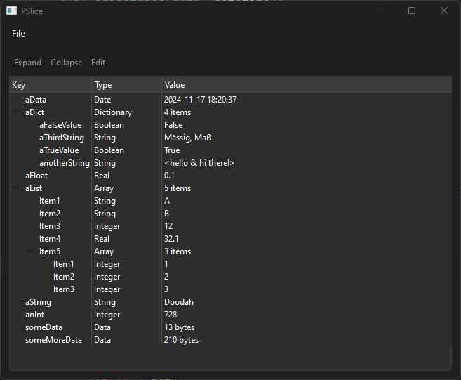

# pslice
Plist editor written in Python and Qt6

## Goal
I am not a fan of the current offerings for a Plist editor. JetBrains Rider works great in this sense, but is not free.

The goal here is to create an intuitive editor.

Why Python and Qt6? Well, Qt6 is the framework I have the most experience with and Python because it can be ran pretty much everywhere.

## Preview

